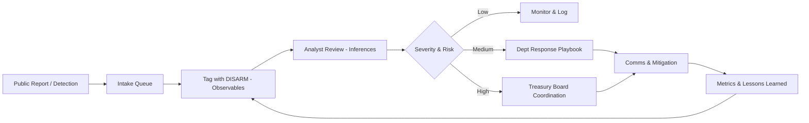

# Information Flow (Directive 4.1.13)

```mermaid
flowchart LR
  A[Public Report / Detection] --> B[Intake Queue]
  B --> C[Tag with DISARM - Observables]
  C --> D[Analyst Review - Inferences]
  D --> E{Severity & Risk}
  E -->|Low| F[Monitor & Log]
  E -->|Medium| G[Dept Response Playbook]
  E -->|High| H[Treasury Board Coordination]
  G --> I[Comms & Mitigation]
  H --> I
  I --> J[Metrics & Lessons Learned]
  J --> C
```
