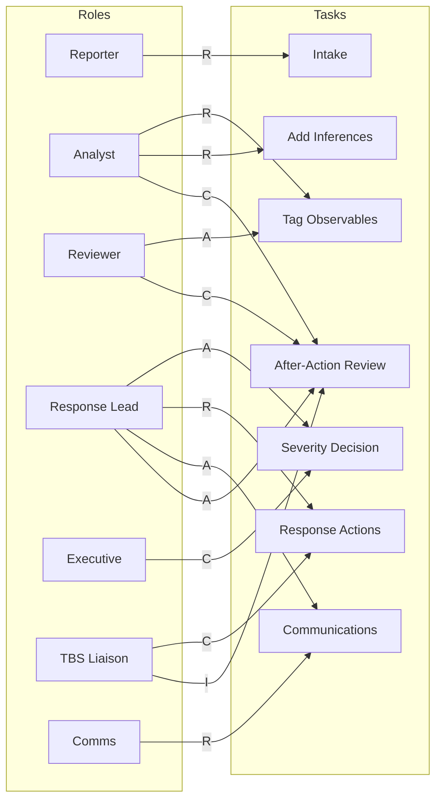

# Roles & RACI (Directive 4.1.13)

```mermaid
flowchart LR
  subgraph Roles
    RPT[Reporter]
    AN[Analyst]
    RV[Reviewer]
    RL[Response Lead]
    EX[Executive]
    TBS[TBS Liaison]
    COM[Comms]
  end
  subgraph Tasks
    INT[Intake]
    TAG[Tag Observables]
    INF[Add Inferences]
    SEV[Severity Decision]
    RESP[Response Actions]
    COMM[Communications]
    AAR[After-Action Review]
  end
  RPT -->|R| INT
  AN  -->|R| TAG
  RV  -->|A| TAG
  AN  -->|R| INF
  RL  -->|A| SEV
  EX  -->|C| SEV
  RL  -->|R| RESP
  TBS -->|C| RESP
  COM -->|R| COMM
  RL  -->|A| COMM
  AN  -->|C| AAR
  RV  -->|C| AAR
  RL  -->|A| AAR
  TBS -->|I| AAR
```

**Legend:** R = Responsible, A = Accountable, C = Consulted, I = Informed.
